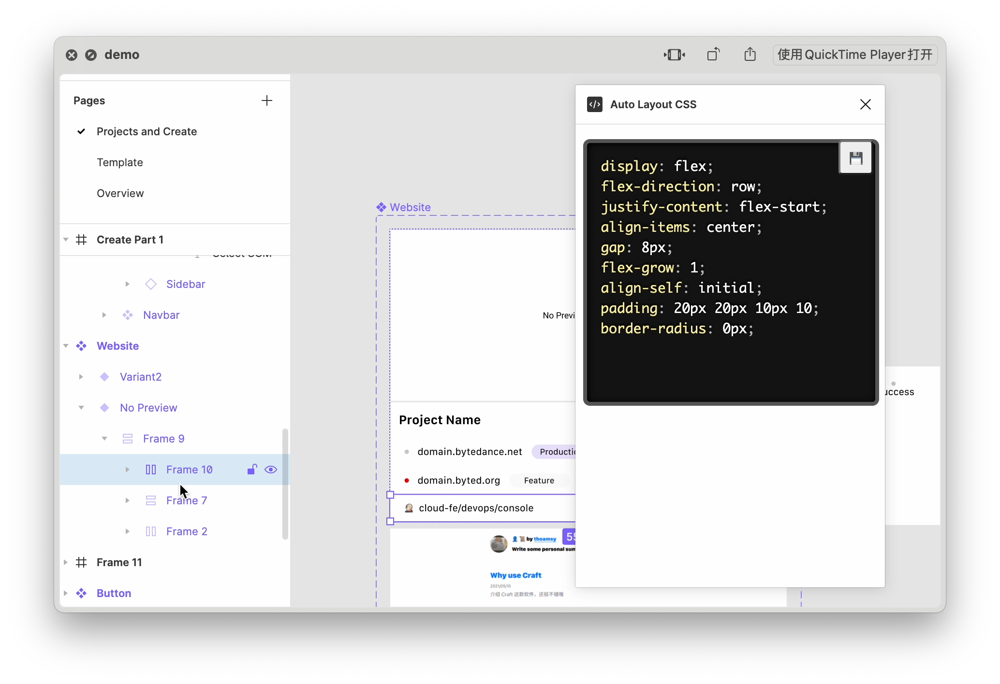

# Figma Auto Layout to Flex

众所周知，Figma 的 Auto Layout 的布局是 CSS Flex 的子集，了解如何阅读 Layout 的属性后就可以很轻松的转化到对应的 CSS 去。

但随着项目的复杂，往往具备 Auto Layout 的 Frame 越来越多，每次都写一些简单但是重复的代码也挺无聊，所以尝试写一个插件来自动解析 CSS（虽然 Figma 也自带了一个，但我觉得不那么好用，并且可以精简）

## Roadmap

1. 定义好一个布局用的 `web-component`，生成对应的 `html` 代码而不仅仅是 `css`
2. 支持同时选中多个 Frame，并生成对应的 `emmet` 代码。比如 `al-layout[gap=8 direction=column]>al-layout[gap=12 direction=row fill]*3`
